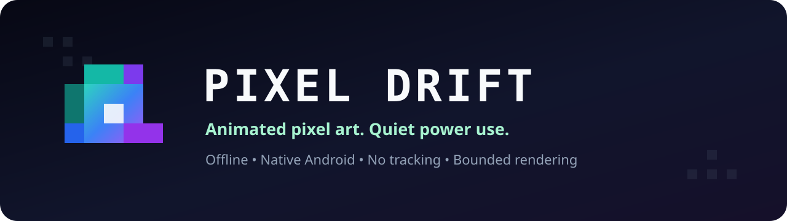

<p align="center">
  
</p>

<p align="center">
  <a href="https://github.com/CarlosArmeroMoneo/pixel-drift/actions/workflows/android.yml"></a>
  
  
  
</p>

Pixel Drift is a native Android live-wallpaper app for custom animated pixel art. Import one static
PNG or WebP sprite sheet, choose the frame grid and speed, then preview and set it through Android's
wallpaper picker.

Imports and edits are isolated as a draft: they never alter an active wallpaper until **Set
wallpaper** is confirmed in Android's preview. Android 14 and newer can keep separate Pixel Drift
artwork and playback settings on the Home and Lock screens.

The renderer is intentionally conservative: it stops all frame work while hidden, caps playback at
24 FPS, freezes in Battery Saver when requested, and uses no network, wake lock, foreground service,
analytics, or unnecessary Android permission.

## Download

**[Download the latest signed APK](https://github.com/CarlosArmeroMoneo/pixel-drift/releases/latest)**

Use APKs from **Releases**, not debug builds or unsigned Actions artifacts. Each release includes a
SHA-256 checksum and signing-certificate evidence. See the [installation guide](docs/INSTALL.md) for
Android's unknown-app prompt, updates, and troubleshooting.

> Version 0.1.1 fixes the live-wallpaper preview crash from 0.1.0. Android API 36 runtime smoke
> testing confirmed that the signed APK opens the real preview, binds the wallpaper service, and
> stays alive without a fatal exception.

## Features

- Static PNG and WebP sprite sheets selected through Android's document picker.
- Equal-cell grids with row-major playback and a configurable active frame count.
- Non-destructive drafts plus independent Home/Lock applied slots on Android 14+.
- Static, 4, 6, 8, 12, 16, or 24 FPS playback; 8 FPS by default.
- Nearest-neighbor pixel scaling with Fit, Fill, Center, and Stretch modes.
- Configurable background color and optional Battery Saver freeze.
- Built-in eight-frame demo—no artwork required to try the app.
- Private atomic artwork storage, bounded decoding, and safe demo fallback.
- Fully offline operation with no telemetry or advertising SDK.

Animated GIF, animated WebP, and APNG are deliberately rejected. Export animations as one static
sprite sheet so authored FPS and battery limits remain honest.

## Quick start

1. Install the latest signed release and open Pixel Drift.
2. Keep the demo or tap **Import artwork**.
3. Enter columns, rows, and active frame count.
4. Choose FPS, scale, and background color.
5. Tap **Save**, then **Preview / Set**.

Frames are read left-to-right and then top-to-bottom. All grid cells must be the same size.

| Artwork | Columns | Rows | Frames |
| --- | ---: | ---: | ---: |
| One still image | 1 | 1 | 1 |
| Eight-frame horizontal strip | 8 | 1 | 8 |
| Eight frames in two rows | 4 | 2 | 8 |

## Safety limits

| Limit | Maximum |
| --- | ---: |
| Encoded file | 25 MiB |
| Decoded pixels | 4,194,304 |
| Bitmap allocation | 16 MiB |
| Width or height | 4096 px |
| Columns or rows | 64 |
| Total grid cells | 256 |
| Playback | 24 FPS |

Pixel Drift stores a validated private revision instead of retaining broad storage access. If an
import or renderer decode fails, the previous valid revision or built-in demo remains available.

## Battery and privacy

A frame can run only while the wallpaper is visible, its surface exists, the screen is interactive,
and the engine has not been destroyed. Deadlines use a monotonic clock and skip expired frames after
a stall instead of creating a catch-up burst.

The app requests no runtime permission and cannot access the network. Backups are disabled, imported
artwork stays in app-private storage, and uninstalling removes that private copy. Read
[PRIVACY.md](PRIVACY.md) and the [architecture notes](docs/ARCHITECTURE.md) for details.

Actual energy use varies by phone, launcher, display, artwork size, and chosen FPS. The
[battery validation protocol](docs/BATTERY_VALIDATION.md) defines the physical-device release gate.

## Build from source

Requirements: JDK 17, Android SDK 36, Build Tools 36.0.0, and the checked-in Gradle 8.13 wrapper.

```bash
./gradlew --no-daemon --dependency-verification=strict --warning-mode all \
  verifyWallpaperSurfaceContract testDebugUnitTest lintDebug lintProfile \
  assembleDebug assembleProfile assembleRelease bundleRelease
```

The build verifies the Gradle wrapper distribution and checksums for all 498 resolved plugin and
dependency artifacts. CI actions are pinned to full commit SHAs and checkout credentials are not
persisted.

The ordinary APK and AAB outputs are unsigned. Official GitHub APKs are signed only by the protected
tag release workflow. Google Play AABs use a separate upload key in a manually approved environment,
while the existing release key remains the app-signing identity. Private signing material never
belongs in the repository. Maintainers should follow [docs/RELEASING.md](docs/RELEASING.md) and the
[Google Play publication runbook](docs/GOOGLE_PLAY.md).

## Verification

- 29 scheduler, power-policy, operation-state, scale-geometry, and grid-inference tests.
- Strict lint with actionable warnings treated as errors.
- Build-time rejection of wallpaper-incompatible `setKeepScreenOn()` calls.
- Debug, profile, minified release, and Android App Bundle compilation on Ubuntu 24.04 with JDK 17
  and SDK 36.
- Exact signed-APK preview smoke on Android API 36 for release 0.1.1.

Physical-device battery, launcher-resume, import-memory, and long-run measurements remain required
before a production release.

## Project documentation

- [Install and troubleshoot](docs/INSTALL.md)
- [Architecture and power policy](docs/ARCHITECTURE.md)
- [Battery validation protocol](docs/BATTERY_VALIDATION.md)
- [Google Play publication runbook](docs/GOOGLE_PLAY.md)
- [Security policy and release certificate](SECURITY.md)
- [Privacy](PRIVACY.md)
- [Contributing](CONTRIBUTING.md)
- [Release process](docs/RELEASING.md)
- [Changelog](CHANGELOG.md)

Security issues should be reported privately through GitHub's vulnerability-reporting flow, not a
public issue. See [SECURITY.md](SECURITY.md).

## License

Pixel Drift is available under the [Apache License 2.0](LICENSE).
